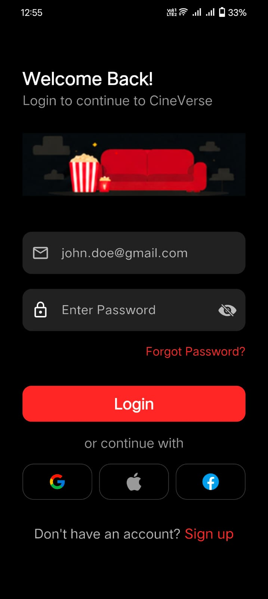
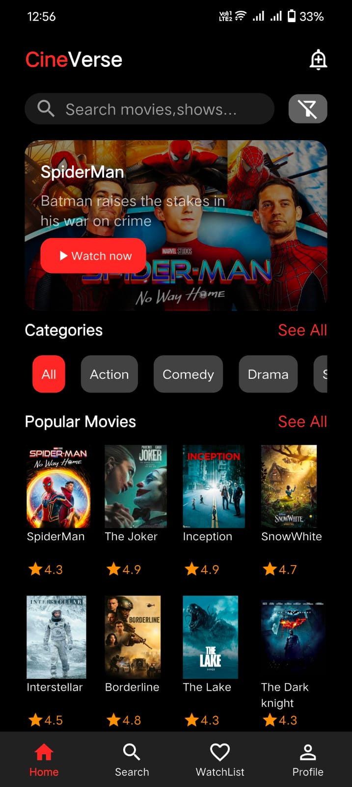
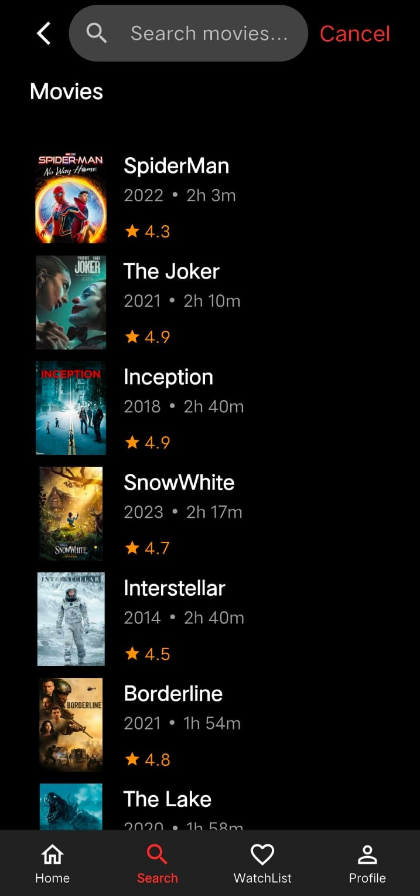

# 🎬 Movie App

A basic Flutter movie app created as a practice project to improve Flutter fundamentals and get hands-on experience with different widgets and UI layouts.

## ✨ Features

* Movie UI design
* Movie search interface
* Movie cards and details
* Different Flutter widgets and layouts
* Responsive UI practice

## 🛠️ Built With

* Flutter
* Dart
* Flutter Widgets
* Material Design

## 📱 Screenshots

  
  
  
 

## 📚 Purpose

This project was mainly built for **Flutter practice and widget learning**. It focuses on understanding how Flutter widgets work together to create a complete mobile UI.

> No state management solution was used in this project.
